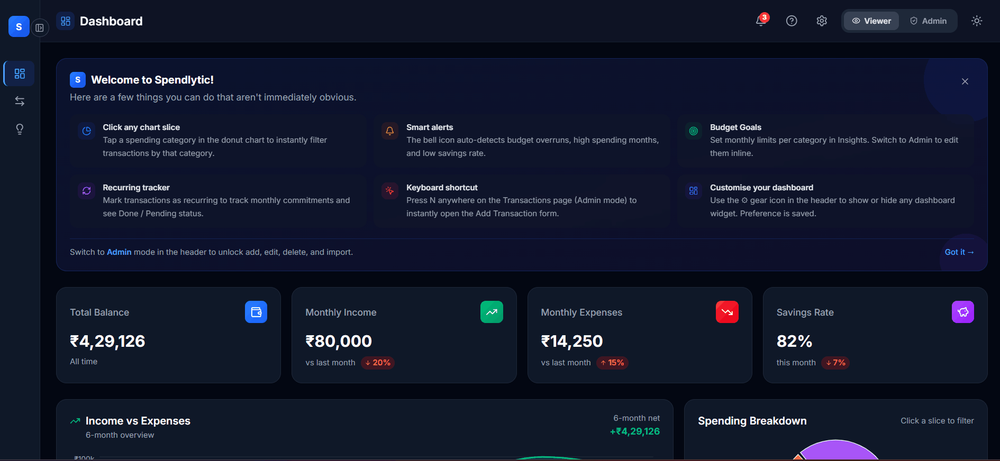
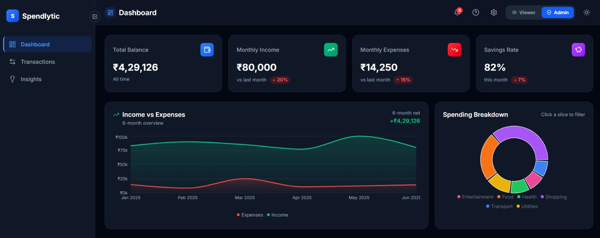
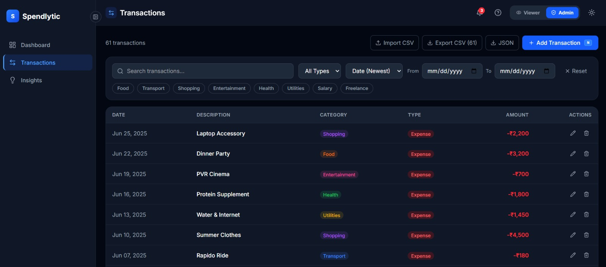
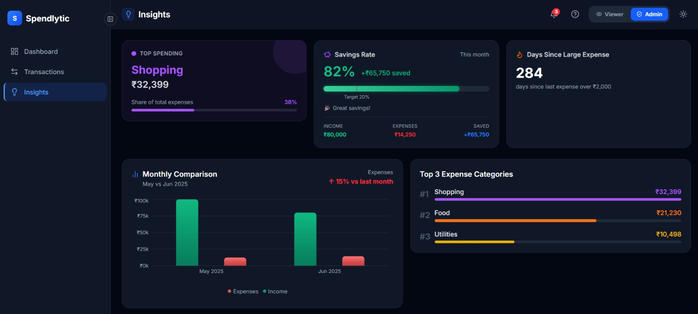

# Spendlytic — Financial Dashboard

A clean, interactive financial dashboard built with React + Vite. Track transactions, visualize spending patterns, set budget goals, and monitor net worth — with role-based access, dark mode, animations, a guided tour, a spending assistant chatbot, and full localStorage persistence. All amounts are in Indian Rupees (₹).



---

## Quick Start

**Prerequisites:** Node.js 18+ and npm

```bash
cd financial-dashboard
npm install
npm run dev
```

Open [http://localhost:5173](http://localhost:5173)

```bash
# Production build
npm run build && npm run preview
```

---

## Environment Variables

A `.env.example` file is included in `financial-dashboard/`. Copy it to `.env` before running the app:

```bash
cd financial-dashboard
cp .env.example .env
```

| Variable                 | Default   | Description                                    |
| ------------------------ | --------- | ---------------------------------------------- |
| `VITE_APP_TITLE`         | `FinDash` | App title shown in the browser tab             |
| `VITE_ENABLE_MOCK_DELAY` | `false`   | Set to `true` to simulate async loading delays |

All variables are prefixed with `VITE_` so Vite exposes them to the client bundle. The app works out of the box with the defaults — `.env` is optional unless you want to override them.

---

## Tech Stack

| Tool                 | Version  | Reason                                                             |
| -------------------- | -------- | ------------------------------------------------------------------ |
| React                | 19.2     | Fast dev server, modern React features                             |
| Vite                 | 8.0      | Near-instant HMR, lightweight build tooling                        |
| Tailwind CSS         | v4.2     | Utility-first styling, dark mode via `class` strategy              |
| Recharts             | 3.8      | Composable, responsive charts (line, area, bar, donut)             |
| Zustand              | 5.0      | Minimal boilerplate state management with localStorage persistence |
| Framer Motion        | 12.38    | Animations — stagger, count-up, hover lift, page transitions       |
| Lucide React         | 1.7      | Consistent icon set                                                |
| date-fns             | 4.1      | Lightweight date formatting and arithmetic                         |
| Inter (Google Fonts) | —        | Clean, readable UI typography                                      |

---

## Pages & Features

### Dashboard



The main overview page. Everything updates live as transactions change.

- **Summary cards** — Total Balance, Monthly Income, Monthly Expenses, Savings Rate with ↑/↓ trend vs last month
- **Income vs Expenses chart** — line chart across 6 months with dot markers and 6-month net callout
- **Spending Breakdown** — donut chart; click any slice to jump to Transactions filtered by that category
- **Quick stats** — largest expense this month, most active category, projected month-end spend
- **Recurring Transactions** — Done ✓ / Pending status per item; total monthly commitments
- **Net Worth Tracker** — assets vs liabilities ratio bar; Admin can add/remove entries inline
- **Customizable Widgets** — show/hide any of the 6 sections via the ⚙ gear icon in the header

---

### Transactions



Full transaction management with filtering, sorting, and export.

- Search by description, category, or notes — with a clear button
- Filter by type, multi-select category chips, and date range — active filters shown as pills
- Sort by date or amount; pagination at 15 rows per page
- Totals summary bar shows live income / expenses / net for the current filtered view
- **Admin only:** Add / Edit / Delete (with confirmation), `N` keyboard shortcut, Notes, Recurring flag
- **Admin only:** Export CSV or JSON; Import CSV with row-level validation

---

### Insights



Computed insights derived entirely from transaction data — nothing is hardcoded.

- **Top Spending Category** — card tinted with the category's own color
- **Savings Rate** — gradient progress bar with a target marker at 20%, ₹ saved amount, and income/expense breakdown
- **Days Since Large Expense** — streak counter for expenses over ₹2,000
- **Monthly Comparison** — bar chart comparing current vs previous month with % change callout
- **Top 3 Categories** — ranked with relative progress bars
- **Budget Goals** — per-category monthly limits with green → amber → red status; Admin edits inline

---

## Guided Tour

A step-by-step interactive tour runs automatically on first visit. It highlights each key UI element with a spotlight overlay and a positioned tooltip card.

- 7 steps covering: Dashboard, Transactions, Insights navigation, Role Switcher, Smart Alerts, Dark Mode, and Widget Customisation
- Blue ring spotlights the active element; rest of the screen is dimmed
- Progress dots, Back / Next / Done navigation
- Click **"Take a Tour"** in the header at any time to restart the tour
- Tour completion is stored in localStorage — auto-start only happens once per browser

---

## Spending Assistant (Chatbot)

A floating chatbot in the bottom-right corner answers natural language questions about your finances, powered entirely by your transaction data — no external API.

- Ask questions like "What's my savings rate?", "How much did I spend this month?", "Show budget status", "Forecast month-end spend"
- Pre-loaded suggestion chips for quick access
- Responds with computed values from the same `useInsights` hook used across the app
- Violet floating button; panel slides up with smooth animation

---

## Role-Based Access

Switch between **Viewer** and **Admin** using the toggle in the header. Role persists across refreshes.

| Capability                       | Viewer | Admin |
| -------------------------------- | ------ | ----- |
| View all data, charts, insights  | ✅     | ✅    |
| Add / Edit / Delete transactions | ❌     | ✅    |
| Import / Export CSV & JSON       | ❌     | ✅    |
| Edit budget limits inline        | ❌     | ✅    |
| Add / remove net worth entries   | ❌     | ✅    |
| `N` keyboard shortcut            | ❌     | ✅    |

---

## Smart Alerts

The bell icon in the header auto-derives alerts from your data — no configuration needed.

- Savings rate drops below 10%
- Current month spending is higher than last month
- Any category reaches 80%+ of its monthly budget
- Any category exceeds its monthly budget

Alerts are color-coded (blue / amber / red) and can be dismissed individually or all at once.

---

## How Budget Goals Work

Tracks spending **per category for the current month only**.

| Progress  | Color    | Status            |
| --------- | -------- | ----------------- |
| Under 80% | 🟢 Green | On track          |
| 80–99%    | 🟡 Amber | Approaching limit |
| 100%+     | 🔴 Red   | Over budget       |

Default limits: Food ₹5,000 · Transport ₹2,000 · Shopping ₹3,000 · Entertainment ₹1,500 · Health ₹2,000 · Utilities ₹3,000

As **Admin**, click the pencil icon next to any limit to edit it inline. Limits are saved to localStorage.

---

## Import CSV Format

Admin users can bulk-import transactions via the **Import CSV** button on the Transactions page.

```
date,description,category,amount,type
2025-07-01,Monthly Salary,Salary,65000,income
2025-07-05,Groceries,Food,2500,expense
```

- `date` — `YYYY-MM-DD`
- `category` — one of: `Food`, `Transport`, `Shopping`, `Entertainment`, `Health`, `Utilities`, `Salary`, `Freelance`
- `type` — `income` or `expense`
- Optional columns: `notes`, `recurring` (`true` / `false`)

Invalid rows are skipped and reported in the toast. The exported CSV can be re-imported without modification.

---

## Optional Enhancements Implemented

| Enhancement                 | Details                                                                                                                                                                                                       |
| --------------------------- | ------------------------------------------------------------------------------------------------------------------------------------------------------------------------------------------------------------- |
| ✅ Dark mode                | System preference on first load; toggled via header; persisted                                                                                                                                                |
| ✅ localStorage persistence | All data stored in your browser — no backend, no account. Persists across refreshes                                                                                                                           |
| ✅ Export CSV + JSON        | RFC 4180 quoted CSV with notes and recurring columns                                                                                                                                                          |
| ✅ Import CSV               | RFC 4180 parser, row-level validation, error reporting                                                                                                                                                        |
| ✅ Advanced filtering       | Multi-select categories, date range, type, sort — all combinable                                                                                                                                              |
| ✅ Animations               | Framer Motion — stagger, count-up, hover lift, page transitions                                                                                                                                               |
| ✅ Budget Goals             | Per-category monthly limits, inline editing, smart color system                                                                                                                                               |
| ✅ Net Worth Tracker        | Assets + liabilities with ratio bar                                                                                                                                                                           |
| ✅ Recurring Transactions   | Done/Pending status, monthly commitment totals                                                                                                                                                                |
| ✅ Spending Forecast        | Projected month-end spend anchored to latest transaction date                                                                                                                                                 |
| ✅ Smart Alerts             | Auto-derived from savings rate, spending trends, budget overruns                                                                                                                                              |
| ✅ Collapsible Sidebar      | Edge toggle, icon-only collapsed state with tooltips                                                                                                                                                          |
| ✅ Customizable Widgets     | Show/hide 6 dashboard sections, persisted                                                                                                                                                                     |
| ✅ Guided Tour              | Auto-starts on first visit; 7-step spotlight tour; restartable via "Take a Tour" button in header                                                                                                             |
| ✅ Spending Assistant       | Floating chatbot answers natural language finance questions from live transaction data                                                                                                                        |
| ✅ Keyboard shortcuts       | `N` to add transaction, `Escape` to close modal                                                                                                                                                               |
| ✅ Drill-down navigation    | Pie chart slice → Transactions filtered by category                                                                                                                                                           |
| ✅ Error boundaries         | Crash recovery without taking down the whole app                                                                                                                                                              |
| ✅ Hash-based routing       | Deep-linking — refresh restores the correct page                                                                                                                                                              |
| ✅ Line chart               | Income vs Expenses rendered as a line chart with dot markers and 6-month net callout                                                                                                                          |

---

## Mock Data

60 transactions · January–June 2025 · 8 categories · Indian Rupees (₹)

Realistic Indian pricing and merchant names (Ola, Rapido, PVR, Wonderla, Barbeque Nation, etc.). Mock data version is auto-detected via a content hash — localStorage clears automatically when data changes, no manual version bumping needed.

---

## Project Structure

```
src/
├── components/
│   ├── layout/       # Sidebar, Header, Layout, AlertsPanel
│   ├── dashboard/    # SummaryCards, BalanceTrendChart (line chart), SpendingBreakdown,
│   │                 # RecurringList, NetWorthCard
│   ├── transactions/ # TransactionTable, TransactionRow, TransactionFilters, AddEditModal
│   ├── insights/     # InsightsPanel, TopSpendingCard, MonthlyComparison,
│   │                 # SavingsRate, BudgetGoals
│   └── ui/           # Badge, EmptyState, RoleSwitcher, Toast, Skeleton,
│                     # ErrorBoundary, WelcomeBanner, TourTooltip, Chatbot
├── context/          # InsightsContext — shared computed insights per page
├── store/            # useTransactionStore, useAppStore, useBudgetStore, useNetWorthStore
├── data/             # mockData.js — 60 transactions, auto-hash versioning
├── hooks/            # useFilteredTransactions, useInsights (5 sub-hooks), useAlerts, useChatbot
├── utils/            # formatCurrency, formatDate, exportData, importData
└── pages/            # Dashboard, Transactions, Insights
```

---

## Architecture & Design Decisions

**Why Zustand over Redux?**
Each store (`useTransactionStore`, `useAppStore`, `useBudgetStore`, `useNetWorthStore`) has a single responsibility with zero boilerplate. Redux would add unnecessary complexity for a frontend-only app with no async middleware needs.

**Why no react-router?**
Only 3 pages. Hash-based routing (`window.location.hash`) achieves deep-linking and refresh-persistence in ~15 lines with zero dependencies.

**Why InsightsContext?**
`useInsights` is an expensive computation across 5 sub-hooks. Without context, every child component runs it independently. `InsightsProvider` wraps each page so the computation runs exactly once and all children share the result via `useInsightsContext`.

**Why split useInsights into 5 sub-hooks?**
A single `useMemo([transactions])` recalculates everything on every change. Splitting into `useDateAnchors`, `useMonthlyTotals`, `useCategoryTotals`, `useBalanceTrend`, `useSpendingStreak` means each only re-runs when its specific inputs change.

**Why a line chart instead of area chart for Income vs Expenses?**
A line chart with dot markers communicates discrete monthly data points more clearly than filled areas, which can visually imply continuity between months. The dots make each month's value immediately readable.

**Why a custom tour instead of a library like Shepherd.js or Intro.js?**
The tour is ~150 lines using Framer Motion (already a dependency) and `getBoundingClientRect`. Adding a dedicated tour library (~30–80KB) would be disproportionate. The custom implementation gives full control over spotlight shape, animation, and positioning logic.

**Why a local chatbot instead of an API-backed one?**
The app is entirely frontend with no backend. The chatbot (`useChatbot`) pattern-matches questions against computed insights from `useInsights` — the same data already available in the app. This gives instant, accurate responses with zero latency and no API key requirements.

**Why mock data anchored to June 2025?**
If mock data used today's date, charts and insights would show empty data for most of the year. Anchoring to the latest transaction date means everything always shows meaningful data regardless of when the app is opened.

**Why a custom CSV parser instead of a library?**
The parser is ~25 lines and handles all needed edge cases (quoted fields, escaped quotes, commas in descriptions). Adding Papa Parse (~50KB) would be disproportionate.

**Other notable decisions:**

- `TransactionRow` wrapped with `React.memo` — only re-renders when its own transaction prop changes
- `DEFAULT_FILTERS` constant in `useTransactionStore` — single source of truth, no duplication
- `formatCurrency` guards against `NaN` — corrupted localStorage data shows `₹0` not `₹NaN`
- `ErrorBoundary` wraps all pages — a crash shows "Try again" without taking down the whole app
- `data-tour` attributes on UI elements — tour targeting is decoupled from class names or DOM structure, making it resilient to styling changes
